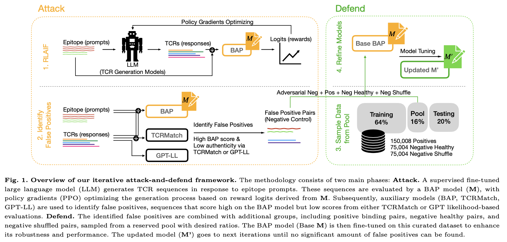
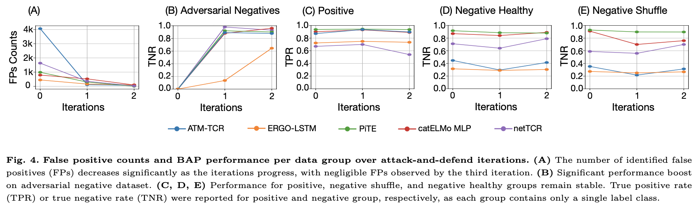
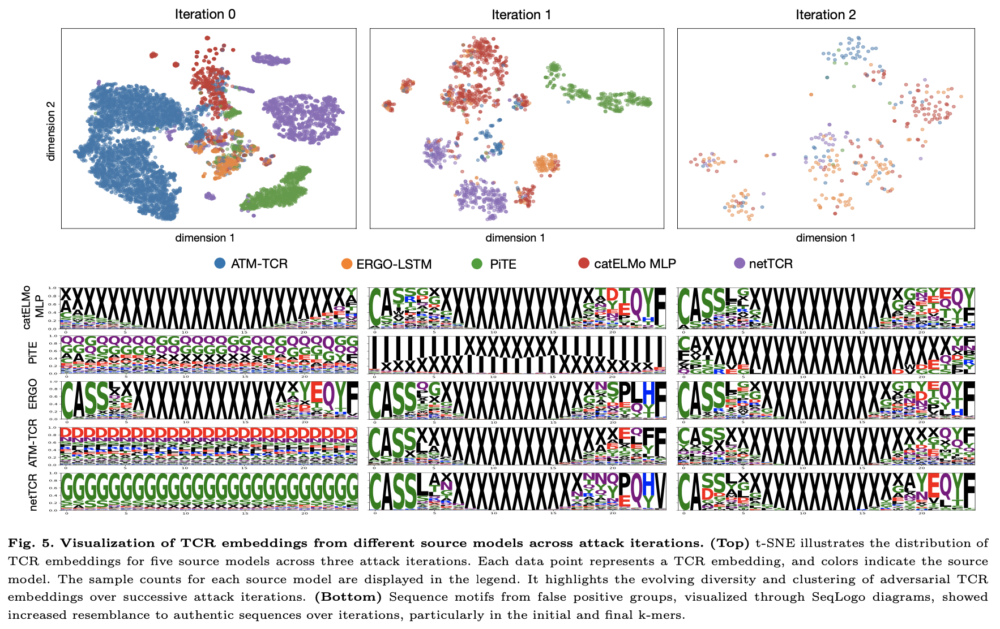

# Iterative Attack-and-Defend Framework for Improving TCR-Epitope Binding Prediction Models

This repository provides a demonstration of our **BAP Attack-and-Defend framework**, with support for the ATM-TCR model as the default binding affinity predictor (BAP). Full support for additional BAP variants and Reinforcement Learning from AI Feedback (RLAIF) methods will be released with the official codebase upon publication. 


## 📜 Abstract

Reliable TCR-epitope binding prediction models are essential for development of adoptive T cell therapy and vaccine design. These models often struggle with false positives, which can be attributed to the limited data coverage in existing negative sample datasets. Common strategies for generating negative samples, such as pairing with background TCRs or shuffling within pairs, fail to account for model-specific vulnerabilities or biologically implausible sequences. To address these challenges, we propose an iterative attack-and-defend framework that systematically identifies and mitigates weaknesses in TCR-epitope prediction models. During the attack phase, a Reinforcement Learning from AI Feedback (RLAIF) framework is used to attack a prediction model by generating biologically implausible sequences that can easily deceive the model. During the defense phase, these identified false positives are incorporated into fine-tuning dataset, enhancing the model's ability to detect false positives. A comprehensive adversarial negative dataset can be obtained by iteratively attacking and defending the model. This dataset can be directly used to improve model robustness, eliminating the need for users to conduct their own attack-and-defend cycles. We apply our framework to five existing binding prediction models, spanning diverse architectures and embedding strategies to show its efficacy. Experimental results show that our approach significantly improves these models' ability to detect adversarial false positives. The combined dataset constructed from these experiments also provides a benchmarking tool to evaluate and refine prediction models. Our framework offers a new approach for improving model robustness in other biological tasks where negative sampling is inherently limited.


<p align="center">
  
  <br/>
  <em>Figure 1: Overview of the iterative attack-and-defend pipeline.</em>
</p>


## Publication
<b>Iterative Attack-and-Defend Framework for Improving TCR-Epitope Binding Prediction Models </b> <br/>
[Pengfei Zhang](https://github.com/pzhang84)<sup>1,2</sup>, Hao Mei<sup>1,2</sup>, [Seojin Bang](http://seojinb.com/)<sup>3</sup>, [Heewook Lee](https://scai.engineering.asu.edu/faculty/computer-science-and-engineering/heewook-lee/)<sup>1</sup>  
<sup>1</sup>School of Computing and Augmented Intelligence, Arizona State University, Tempe, AZ 85281  
<sup>2</sup>Biodesign Institute, Arizona State University, Tempe, AZ 85281  
<sup>3</sup>Google DeepMind, Mountain View, CA 94043  
Accepted at **ISMB/ECCB 2025** and published in the **Bioinformatics Proceedings**.


[Paper]([https://doi.org/10.7554/eLife.88837.1](https://academic.oup.com/bioinformatics/article/41/Supplement_1/i429/8199358)) | [Code](https://github.com/Lee-CBG/BAP_Attack_n_Defend) | [Poster](https://github.com/Lee-CBG/BAP_Attack_n_Defend/blob/main/figures/Zhang_Pengfei_42x42.pdf) | [Slides](https://docs.google.com/presentation/d/1ZJSgte9NFXbzEt2Jf2oWojRJgfqCnYdsM_-UFCZV6Hc/edit?usp=sharing) 


## 📊 Main Results

Our attack-and-defend framework significantly improves model robustness and reduces false positives. Below are two key results from the paper.

### 🔹 Figure: Model-Wise Performance After Each Iteration

<p align="center">
  
  <br/>
  <em>As iterations continue: (1) fewer false positives are discovered, and (2) performance improves on adversarial negatives without harming other data groups. This indicates the prediction model becomes more robust and less vulnerable to attacks.</em>
</p>

---

### 🔹 Figure: Adversarial Negatives Visualization

<p align="center">
  
  <br/>
  <em>Our framework discovers model-specific adversarial negatives in early iterations. Over time, as the model is iteratively attacked and defended, the adversarial points become fewer, more indistinguishable, and model-agnostic.</em>
</p>

These results validate the effectiveness and generalizability of our framework across architectures and embeddings.


## 🚀 Getting Started

### 🔧 Reproduction Script
Please run the bap_attack.py file with the default configuration. It will choose a regression model as the default reward update method (provided by TRL library)
The default BAP model is ATM-TCR for simplicity and computation efficiency.


### Data Storage
Generated data will be automatically stored at directory **bap_attack/outputs/<Y-M-D>/<H-M-S>/iter_<Number>** folder. The updated BAP model is stored at the same level directory for later evaluation.

### Authentic Filtering
To generate negative control samples, we apply the filter under **bap_attack/utils/evaluator** directory and it is automatically called in our reproduction script. 

## Envrionment configuration

### `bap_attack` Dependencies
This is used in RLAIF generation model.

Install the following Python packages in your main environment (or a new one):

```bash
pip install trl==0.11.1 torch==2.0.1 pandas==2.2.3 numpy==1.26.4 wandb==0.18.3 hydra-core==1.3.2
```


### An example with ATM-TCR as BAP model
The BAP model is a standalone module that must be cloned and configured before running the attack pipeline. In this demo, we use ATM-TCR as the default BAP model.

Step 1: 
fork ATM-tcr from https://github.com/Lee-CBG/ATM-TCR at copy to the same level of bap_attack
--root_dir
  --bap_attack
  --ATM-TCR

Step 2: 
configure conda environment and name as **atm-tcr** for subprocess running.
dependencies:

```bash
pip install pytorch==1.5.0 scikit-learn==1.3.2 numpy==1.24.4 pandas==2.0.3
```


## 📜 Citation

If you find **BAP Attack-n-Defend** useful for your research, please cite our work:

```
@article{zhang2025iterative,
  title={Iterative attack-and-defend framework for improving TCR-epitope binding prediction models},
  author={Zhang, Pengfei and Mei, Hao and Bang, Seojin and Lee, Heewook},
  journal={Bioinformatics},
  volume={41},
  number={Supplement\_1},
  pages={i429--i438},
  year={2025},
  publisher={Oxford University Press}
}
```

---

## 🤝 Contributing

We welcome contributions! Please submit a pull request or open an issue if you encounter any problems. 
